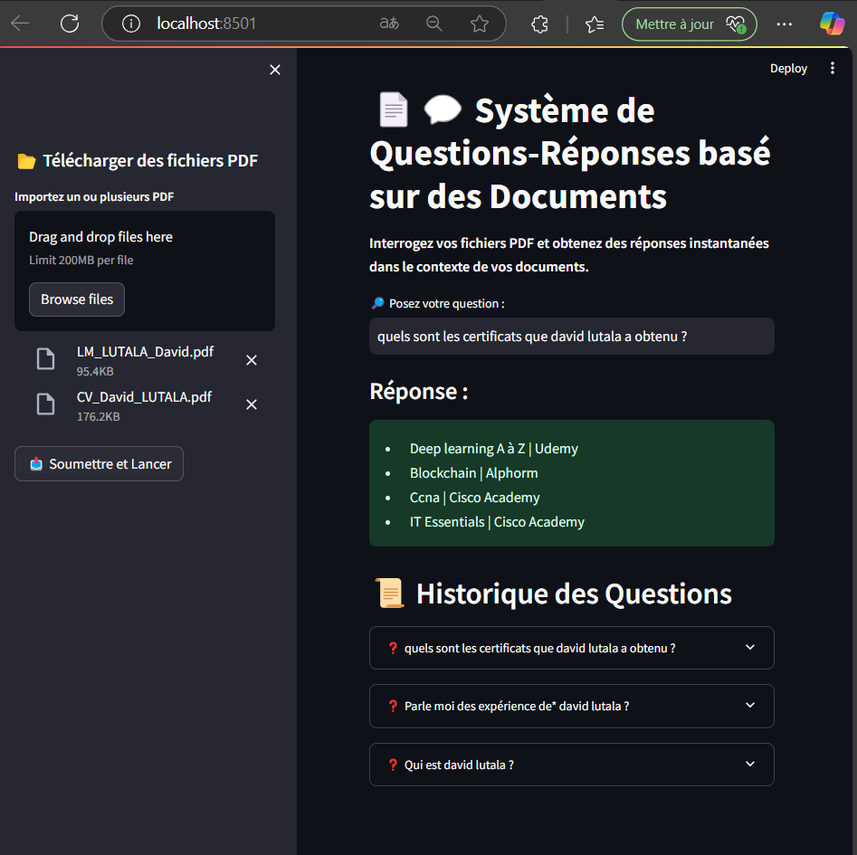
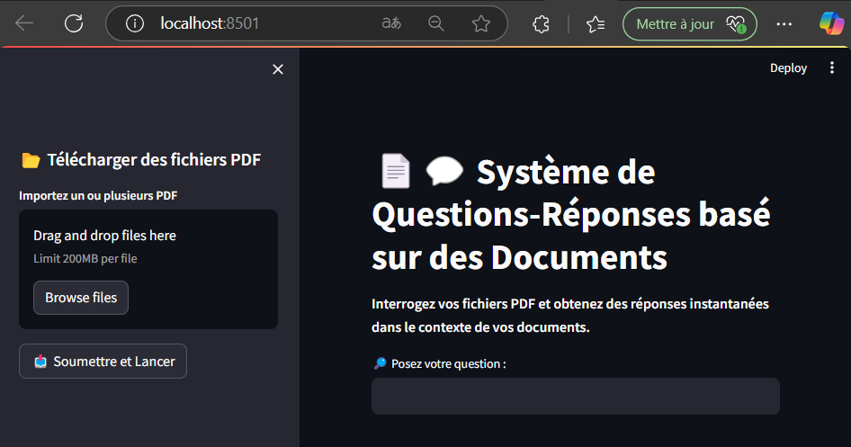
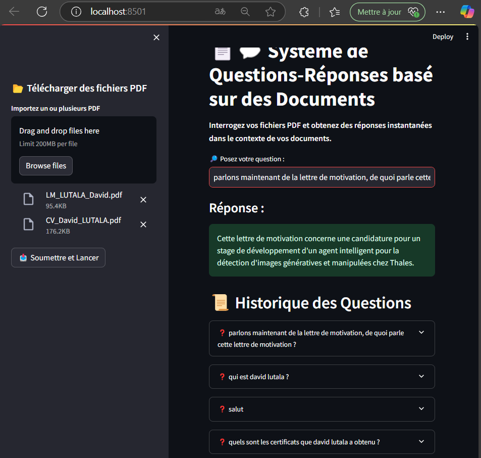
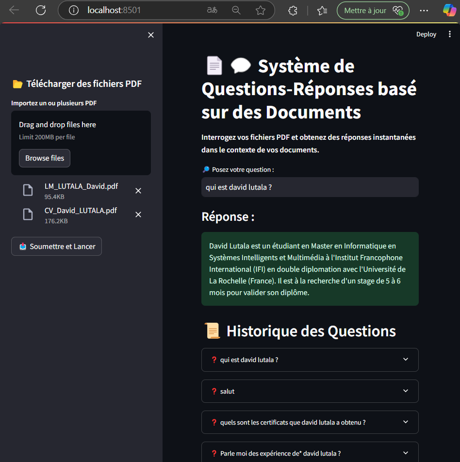
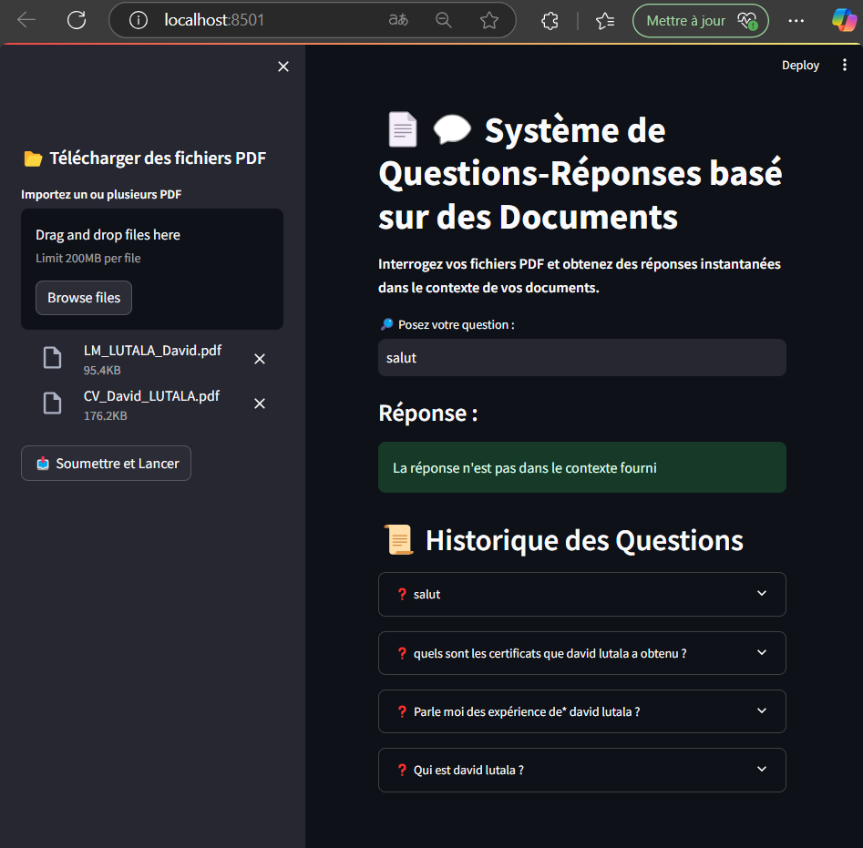

# 📄💬 Q/R Documents - Système de Questions-Réponses basé sur des Documents

## 📌 Déscription

Q/R Documents est une application interactive qui vous permet d'interroger vos fichiers PDF et d'obtenir des réponses précises en fonction de leur contenu. Grâce à l'intégration de modèles d'intelligence artificielle avancés, ce système extrait, segmente et indexe les informations contenues dans vos documents pour générer des réponses pertinentes.



## 🚀 Fonctionnalités

- 📂 **Importation de fichiers PDF** : Téléchargez un ou plusieurs documents pour analyse.
- 🔍 **Interrogation intelligente** : Posez des questions en langage naturel et obtenez des réponses basées sur le contenu des documents PDF.
- 🧠 **Mémorisation des échanges** : Suivi et conservation des interactions pour une expérience utilisateur améliorée.
- ⚡ **Traitement rapide** : Extraction et indexation des textes optimisées pour une recherche efficace.
- 🎯 **Modèle avancé** : Utilisation de `GoogleGenerativeAI` et `FAISS` pour un stockage et une récupération performante des informations.

## ▶️ Installation

### 1️⃣ Prérequis
- Python 3.8+
- Un compte Google Cloud avec une clé API
- Virtualenv (optionnel mais recommandé)

### 2️⃣ Cloner le projet
```sh
git clone https://github.com/DavidLUTALA/Q-R_Documents.git
cd Q-R_Documents
```

### 3️⃣ Créer un environnement virtuel
```sh
python -m venv venv
source venv/bin/activate  # Sur Windows : venv\Scripts\activate
pip install -r requirements.txt
```

### 4️⃣ Installer les dépendances
```sh
pip install -r requirements.txt
```

### 5️⃣ Configurer la clé API Google
- Créez un fichier `.env`
- Ajoutez votre clé API Google Generative AI :
```sh
GOOGLE_API_KEY=your_google_api_key
```


## 📥 Utilisation

**Lancez l'application avec la commande suivante** :
```sh
streamlit run app.py
```
Puis, importez vos fichiers PDF via l'interface et commencez à poser vos questions.



## 🛠️ Technologies utilisées

- **Python** : Langage principal du projet
- **Streamlit** : Interface utilisateur interactive et simple
- **LangChain** : Gestion avancée des chaînes de traitement du langage naturel
- **FAISS** : Base de données vectorielle pour une recherche efficace
- **Google Generative AI** : Modèle IA avancé pour la génération de réponses
- **PyPDF2** : Extraction de texte à partir de fichiers PDF


## 💡 Cas d'utilisation

- 📖 **Étudiants et chercheurs** : Aider les étudiants et chercheurs à extraire des données utiles de leurs documents académiques.
- 🏢 **Professionnels** : Analyser des contrats, rapports et documents techniques pour en extraire rapidement des informations clés de documents légaux.
- 📰 **Journalistes et analystes** : Interroger des articles scientifiques, livres, ou rapports et en extraire des informations clés à partir de sources volumineuses.



## 🤝 Contribution

Les contributions sont les bienvenues ! Pour toute amélioration ou correction, merci de soumettre une Pull Request.



## 📧 Contact

Si vous avez des questions ou des suggestions, n'hésitez pas à me contacter par mail par [davidlutala0@gmail.com](davidlutala0@gmail.com) ou par LinkedIn via [David Lutala](https://www.linkedin.com/in/david-lutala-719952164/) ou à ouvrir une issue sur GitHub.

---



⭐ Si ce projet vous plaît, n'oubliez pas de laisser une étoile sur GitHub ! ⭐
